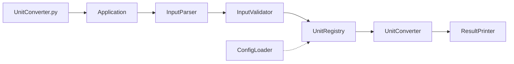

# Unit Converter — Product Requirements Document (PRD)

**문서 버전:** 1.3  
**기준 문서:** [`README.md`](../README.md)  
**대상:** Python CLI 길이 단위 변환 프로그램 (`UnitConverter.py`)  
**실습:** 생성형 AI 활용 워크숍 (6시간)

---

## 1. 개요 (Overview)

### 1.1 제품 목적

사용자가 `단위:값` 형식으로 길이를 입력하면, 등록된 **모든 단위**로 변환 결과를 출력하는 **커맨드라인 단위 변환기**를 구현한다.

README Overview 3가지 원칙:

1. 사용자가 입력한 길이(`단위:값`)를 기반으로, 해당 값을 다른 모든 단위로 변환해 출력한다.
2. 새로운 단위를 추가할 때 기존 코드의 변경이 최소화되도록 설계한다.
3. 각 단위 변환 로직은 테스트 코드로 검증한다.

### 1.2 핵심 목표

| 목표 | 설명 |
|------|------|
| 정확한 변환 | meter 기준 비율로 모든 단위 간 변환 |
| 확장성 | 새 단위 추가 시 기존 코드 변경 최소화 (OCP) |
| 품질 | SRP 기반 클래스 설계 + 테스트 코드로 검증 |
| 고도화 | 설정 외부화, 동적 단위 등록, 출력 포맷 선택 (Phase 2) |

### 1.3 대상 사용자

- CLI에서 길이 단위를 빠르게 변환하려는 개발자
- 클린 코드·리팩터링·TDD 실습 참가자

### 1.4 실행 환경

```bash
# 가상환경 생성
python -m venv venv

# 가상환경 활성화 (Windows)
venv\Scripts\activate

# 가상환경 활성화 (macOS/Linux)
source venv/bin/activate

# 실행
python UnitConverter.py

# 가상환경 비활성화
deactivate
```

---

## 2. 범위 (Scope)

### 2.1 In Scope

| Phase | 범위 | 요구 ID |
|-------|------|---------|
| **Phase 1** | 파싱·변환·입력 검증, OCP/SRP, pytest | FR-01~05, NFR-01~02 |
| **Phase 2** | 설정 로드, 동적 등록, 출력 포맷 | EXT-01~03 |

### 2.2 Out of Scope

- GUI / 웹 UI
- 길이 외 물리량 (무게, 온도 등)
- 다국어 UI
- 영구 저장 DB (설정 파일 수준은 In Scope)

---

## 3. 요구사항 ↔ 테스트 추적성 (Traceability Matrix)

> **원칙:** 모든 FR/NFR/EXT는 테스트 ID와 **1:1** 매핑한다.  
> 테스트 파일 권장 경로: `tests/test_<요구ID>.py` 또는 `tests/test_requirements.py` 내 동명 함수.

### 3.1 Functional Requirements (FR) — P0

| ID | 요구 | Given | Then | P | Test ID | 테스트 함수 (권장) |
|----|------|-------|------|---|---------|-------------------|
| FR-01 | `meter:2.5` 파싱 | 유효 문자열 `"meter:2.5"` | `value=2.5`, `unit="meter"` | P0 | **TEST-FR-01** | `test_fr01_parse_valid_input` |
| FR-02 | 전 단위 출력 | 입력 `meter`, `2.5` | `feet≈8.2021`, `yard≈2.7340` (README 비율) | P0 | **TEST-FR-02** | `test_fr02_convert_to_all_units` |
| FR-03 | unknown unit | `"cubit:1"` (미등록) | 명확한 에러 메시지 | P0 | **TEST-FR-03** | `test_fr03_unknown_unit_error` |
| FR-04 | 음수 | `"meter:-1"` | 거부 또는 예외 | P0 | **TEST-FR-04** | `test_fr04_negative_value_rejected` |
| FR-05 | 형식 오류 | `"meter/abc"` 또는 `"meter2.5"` | 형식 에러 | P0 | **TEST-FR-05** | `test_fr05_invalid_format_error` |

### 3.2 Non-Functional Requirements (NFR) — P0

| ID | 요구 | Given | Then | P | Test ID | 테스트 함수 (권장) |
|----|------|-------|------|---|---------|-------------------|
| NFR-01 | OCP | `inch` 단위 추가 | 기존 Converter 코드 **수정 없음** (등록만) | P0 | **TEST-NFR-01** | `test_nfr01_add_unit_without_modifying_converter` |
| NFR-02 | SRP | — | Parser / Registry / Converter / Printer **분리** | P0 | **TEST-NFR-02** | `test_nfr02_components_exist_and_separated` |

### 3.3 Extension Requirements (EXT) — P1

| ID | 요구 | Given | Then | P | Test ID | 테스트 함수 (권장) |
|----|------|-------|------|---|---------|-------------------|
| EXT-01 | 설정 파일 | `units.json` | 비율 로드 | P1 | **TEST-EXT-01** | `test_ext01_load_ratios_from_config` |
| EXT-02 | 동적 등록 | `1 cubit = 0.4572 m` 정의 | 즉시 변환 가능 | P1 | **TEST-EXT-02** | `test_ext02_dynamic_unit_registration` |
| EXT-03 | 출력 포맷 | `--format` 플래그 | `json` / `csv` / `table` 검증 | P1 | **TEST-EXT-03** | `test_ext03_output_format_selection` |

### 3.4 추적성 요약 (1:1 매핑)

| 요구 ID | Test ID | Phase |
|---------|---------|-------|
| FR-01 | TEST-FR-01 | 1 |
| FR-02 | TEST-FR-02 | 1 |
| FR-03 | TEST-FR-03 | 1 |
| FR-04 | TEST-FR-04 | 1 |
| FR-05 | TEST-FR-05 | 1 |
| NFR-01 | TEST-NFR-01 | 1 |
| NFR-02 | TEST-NFR-02 | 1 |
| EXT-01 | TEST-EXT-01 | 2 |
| EXT-02 | TEST-EXT-02 | 2 |
| EXT-03 | TEST-EXT-03 | 2 |

---

## 4. 요구사항 상세

### 4.1 FR-01 — 입력 파싱

| 항목 | 내용 |
|------|------|
| **Test ID** | TEST-FR-01 |
| **Given** | `"meter:2.5"` |
| **When** | Parser.parse() 호출 |
| **Then** | `ParsedInput(value=2.5, unit="meter")` |
| **README** | 기본 요구사항 1 — `단위:값` 형식 |

**추가 TC (동일 TEST-FR-01 범위):**

- `"feet:10"`, `"yard:1"` 등 지원 단위 파싱
- `"meter:abc"` → TEST-FR-05로 위임 (비숫자)

---

### 4.2 FR-02 — 전 단위 변환 출력

| 항목 | 내용 |
|------|------|
| **Test ID** | TEST-FR-02 |
| **Given** | `unit="meter"`, `value=2.5` |
| **When** | Converter.convert_all() 호출 |
| **Then** | `feet ≈ 2.5 × 3.28084 = 8.2021`, `yard ≈ 2.5 × 1.09361 = 2.7340` |
| **README** | 기본 요구사항 1·2, 비즈니스 로직 |

**비즈니스 로직:**

| 규칙 | 값 |
|------|-----|
| meter → feet | `1 meter = 3.28084 feet` |
| meter → yard | `1 meter = 1.09361 yard` |
| feet ↔ yard | meter 기준으로 계산 |

**출력 예시 (README):**

```
2.5 meter = 8.2 feet
2.5 meter = 2.7 yard
```

> 표시 반올림(소수 1자리)과 TC 정밀도(비율 상수)는 구분. TEST-FR-02는 **비율 상수 기준 assert**.

---

### 4.3 FR-03 — 미등록 단위

| 항목 | 내용 |
|------|------|
| **Test ID** | TEST-FR-03 |
| **Given** | `"cubit:1"` |
| **When** | parse + convert 시도 |
| **Then** | 변환 없음, `Unknown unit: cubit` 등 명확한 에러 |
| **README** | 품질 요구사항 — 없는 단위 |

---

### 4.4 FR-04 — 음수 거부

| 항목 | 내용 |
|------|------|
| **Test ID** | TEST-FR-04 |
| **Given** | `"meter:-1"` |
| **When** | parse + validate |
| **Then** | 변환 없음, 예외 또는 에러 메시지 |
| **README** | 품질 요구사항 — 음수 |

---

### 4.5 FR-05 — 형식 오류

| 항목 | 내용 |
|------|------|
| **Test ID** | TEST-FR-05 |
| **Given** | `"meter/abc"`, `"meter2.5"` (콜론 없음) |
| **When** | parse |
| **Then** | 형식 에러, 변환 없음 |
| **README** | 품질 요구사항 — 잘못된 형식 |

---

### 4.6 NFR-01 — OCP (Open-Closed Principle)

| 항목 | 내용 |
|------|------|
| **Test ID** | TEST-NFR-01 |
| **Given** | 기존 Converter + Registry에 `inch` 등록 (`1 inch = 0.0254 meter`) |
| **When** | `inch:12` 변환 |
| **Then** | 변환 성공, **Converter/Printer 클래스 소스 수정 없음** |
| **README** | 기본 요구사항 3, OCP |

**검증 방법:** Registry에만 등록 API 호출; Converter 내부 if-elif 분기 추가 없이 통과.

---

### 4.7 NFR-02 — SRP (Single Responsibility Principle)

| 항목 | 내용 |
|------|------|
| **Test ID** | TEST-NFR-02 |
| **Given** | 리팩터링된 코드베이스 |
| **When** | 모듈/클래스 구조 검사 |
| **Then** | **Parser**, **Registry**, **Converter**, **Printer** 4 컴포넌트 분리 존재 |
| **README** | SRP를 만족하는 클래스 구성 |

**검증 방법:** import/클래스 존재 assert + Parser는 I/O 없이 파싱만, Converter는 print 없이 변환만.

---

### 4.8 EXT-01 — 설정 외부화

| 항목 | 내용 |
|------|------|
| **Test ID** | TEST-EXT-01 |
| **Given** | `units.json` (meter/feet/yard 비율) |
| **When** | Registry.load_from_file("units.json") |
| **Then** | README 비율과 동일하게 로드, FR-02 변환 결과 일치 |
| **README** | 추가 요구사항 — 설정 외부화 |

---

### 4.9 EXT-02 — 동적 단위 등록

| 항목 | 내용 |
|------|------|
| **Test ID** | TEST-EXT-02 |
| **Given** | `registry.register("cubit", meters_per_unit=0.4572)` |
| **When** | `cubit:1` 변환 |
| **Then** | meter/feet/yard/cubit 전 단위 출력 |
| **README** | 추가 요구사항 — `1 cubit = 0.4572 meter` |

---

### 4.10 EXT-03 — 출력 포맷

| 항목 | 내용 |
|------|------|
| **Test ID** | TEST-EXT-03 |
| **Given** | `meter:2.5`, `--format json\|csv\|table` |
| **When** | Printer 출력 |
| **Then** | 각 포맷 스키마/구분자/표 형태 검증 |
| **README** | 추가 요구사항 — JSON / CSV / 표 |

---

## 5. 사용자 시나리오

| US | 시나리오 | 요구 ID | Test ID |
|----|----------|---------|---------|
| US-01 | `meter:2.5` → 전 단위 변환 | FR-01, FR-02 | TEST-FR-01, TEST-FR-02 |
| US-02 | 잘못된 입력 처리 | FR-03~05 | TEST-FR-03~05 |
| US-03 | inch 등 단위 확장 | NFR-01 | TEST-NFR-01 |
| US-04 | 컴포넌트 분리 구조 | NFR-02 | TEST-NFR-02 |
| US-05 | 설정·동적 등록·출력 포맷 | EXT-01~03 | TEST-EXT-01~03 |

---

## 6. Mom Test 결과

> README 요구사항의 **왜(Why)** 를 검증한 인터뷰 결과.

### 6.1 페르소나

**김민수** (32세, 백엔드·임베디드 개발자, 경력 5년)

### 6.2 진짜 문제 (한 문장)

**작업 중 터미널 흐름을 끊지 않고 여러 길이 단위를 정확·일관되게 맞춰야 하는데, 검색·수기 계산·도구 전환·레거시 코드 수정 때문에 시간이 들고 숫자가 어긋날 위험이 있다.**

### 6.3 Mom Test 증거 ↔ 요구 매핑

| 증거 | 요구 ID | Test ID |
|------|---------|---------|
| 음수 통과·재입력 | FR-04 | TEST-FR-04 |
| cubit 추가 시 세 곳 수정 | NFR-01 | TEST-NFR-01 |
| 테스트 없음·숫자 불일치 | FR-02 | TEST-FR-02 |
| 형식 오류 재입력 | FR-05 | TEST-FR-05 |
| cubit unknown | FR-03 | TEST-FR-03 |
| 슬랙 수동 정리 | EXT-03 | TEST-EXT-03 |

---

## 7. 실습 로드맵 (README Activities)

| # | Activity | 시간 | Test ID 범위 |
|---|----------|------|--------------|
| 1 | 분석 | 0.5h | — |
| 2 | 기본·품질 구현 | 2h | FR-01~05, NFR-01~02 구현 |
| 3 | TC 구현 | 0.5h | TEST-FR-01~05, TEST-NFR-01~02 **green** |
| 4 | 추가 요구사항 | 2h | TEST-EXT-01~03 **green** |
| 5 | 회고 | 1h | 추적성 매트릭스 전체 점검 |

---

## 8. 세션 3 워크북

### 8.1 주제

레거시 `UnitConverter.py`의 FR-03~05, NFR-01~02, FR-02 갭을 테스트 가능한 구조로 메운다.

### 8.2 성공 기준 (Mom Test ↔ Test ID)

| # | 성공 기준 | Test ID |
|---|-----------|---------|
| 1 | 입력 검증 (음수·형식·unknown) | TEST-FR-03, TEST-FR-04, TEST-FR-05 |
| 2 | 단위 추가 시 Converter 미수정 | TEST-NFR-01 |
| 3 | **meter↔feet↔yard 변환 정확도** — README 비율 (`1m=3.28084ft`, `1m=1.09361yd`), feet↔yard는 meter 경유 일치 | TEST-FR-02, D-CNV-01, D-CNV-02, D-CNV-03 |
| 4 | `meter:2.5` 파싱 및 **3단위 이상 CLI 출력** | TEST-FR-01, U-OUT-01 |

> **#3 보충:** Mom Test 증거 3(동료와 숫자 불일치)의 핵심은 **지원 단위 3종 간 변환 정확성**이다.  
> `TEST-FR-02`는 `meter:2.5 → feet/yard` 일괄 변환, `D-CNV-*`는 `to_meter`·5자리 정밀도·meter 경유 일관성을 각각 검증한다.

---

## 9. 레거시 갭 (구현 상태)

| 요구 ID | Test ID | 모듈 | 상태 |
|---------|---------|------|------|
| FR-01 | TEST-FR-01 | `parser.py` | ✅ 스켈레톤 |
| FR-02 | TEST-FR-02 | `converter.py` | ✅ 스켈레톤 |
| FR-03 | TEST-FR-03 | `validator.py` | ✅ 스켈레톤 |
| FR-04 | TEST-FR-04 | `validator.py` | ✅ 스켈레톤 |
| FR-05 | TEST-FR-05 | `parser.py` | ✅ 스켈레톤 |
| NFR-01 | TEST-NFR-01 | `registry.py` | ✅ 스켈레톤 |
| NFR-02 | TEST-NFR-02 | 패키지 구조 | ✅ 스켈레톤 |
| EXT-01 | TEST-EXT-01 | `config_loader.py` | ⚠️ 구현됨, TC 미작성 |
| EXT-02 | TEST-EXT-02 | `registry.register()` | ⚠️ API만, TC 미작성 |
| EXT-03 | TEST-EXT-03 | `printer.py` | ⚠️ 구현됨, TC 미작성 |

---

## 10. 수용 기준 체크리스트

### Phase 1 Exit (P0)

- [ ] TEST-FR-01 green
- [ ] TEST-FR-02 green
- [ ] TEST-FR-03 green
- [ ] TEST-FR-04 green
- [ ] TEST-FR-05 green
- [ ] TEST-NFR-01 green
- [ ] TEST-NFR-02 green

### Phase 2 Exit (P1)

- [ ] TEST-EXT-01 green
- [ ] TEST-EXT-02 green
- [ ] TEST-EXT-03 green

### 추적성 Exit

- [ ] §3.4 매트릭스 10건 **요구 ID ↔ Test ID 1:1** 전부 green
- [ ] `pytest` 실행 시 TEST-* 함수명 또는 `@pytest.mark`로 요구 ID 식별 가능

---

## 11. 아키텍처 (OCP / SRP 패키지 구조)

### 11.1 디렉터리 구조

```
UnitConverter_17/
├── UnitConverter.py              # CLI 진입점 (얇은 main)
├── unit_converter/
│   ├── __init__.py               # 공개 API re-export
│   ├── models.py                 # ParsedInput, ConversionResult
│   ├── exceptions.py             # ParseError, ValidationError, UnknownUnitError
│   ├── parser.py                 # InputParser           (SRP: 파싱)
│   ├── validator.py              # InputValidator        (SRP: 검증)
│   ├── registry.py               # UnitRegistry          (SRP + OCP 확장점)
│   ├── converter.py              # UnitConverter         (SRP: 변환)
│   ├── printer.py                # ResultPrinter         (SRP: 출력)
│   ├── config_loader.py          # ConfigLoader          (EXT-01)
│   └── app.py                    # Application           (오케스트레이션)
├── config/
│   └── units.json                # 기본 비율 (EXT-01)
└── tests/
    ├── conftest.py
    ├── test_fr01_parser.py
    ├── test_fr02_converter.py
    ├── test_fr03_unknown_unit.py
    ├── test_fr04_negative.py
    ├── test_fr05_format.py
    ├── test_nfr01_ocp.py
    └── test_nfr02_srp.py
```

### 11.2 컴포넌트 책임 (NFR-02)

| 컴포넌트 | 모듈 | 책임 | 하지 않는 것 |
|----------|------|------|--------------|
| **InputParser** | `parser.py` | `"meter:2.5"` → `ParsedInput` | 검증, 변환, 출력 |
| **InputValidator** | `validator.py` | 음수·미등록 단위 거부 | 파싱, 변환 |
| **UnitRegistry** | `registry.py` | 단위명 ↔ meter 비율 저장·등록 | 변환 계산 |
| **UnitConverter** | `converter.py` | meter 환산 → 전 단위 `ConversionResult` | 단위 if-elif |
| **ResultPrinter** | `printer.py` | table / json / csv 출력 | 변환 로직 |
| **Application** | `app.py` | 컴포넌트 조립·실행 순서 | 도메인 규칙 직접 구현 |
| **ConfigLoader** | `config_loader.py` | JSON/YAML → Registry (Phase 2) | CLI |

### 11.3 OCP 확장점 (NFR-01)

단위 추가 시 **수정 위치는 `UnitRegistry`만**:

```python
registry.register("inch", meters_per_unit=0.0254)   # EXT-02
registry.load_from_file("config/units.json")        # EXT-01
```

**수정하지 않는 모듈:** `converter.py`, `parser.py`, `validator.py`

`UnitConverter.convert_all()`은 Registry를 순회하며 변환 — 단위별 분기 없음.

### 11.4 데이터 흐름



### 11.5 FR/NFR → 모듈 매핑

#### Functional Requirements

| ID | 요구 | 모듈 | 클래스/함수 | Test ID |
|----|------|------|-------------|---------|
| FR-01 | 파싱 | `parser.py` | `InputParser.parse()` | TEST-FR-01 |
| FR-02 | 전 단위 변환 | `converter.py`, `registry.py` | `UnitConverter.convert_all()` | TEST-FR-02 |
| FR-03 | unknown unit | `validator.py` | `InputValidator.validate()` → `UnknownUnitError` | TEST-FR-03 |
| FR-04 | 음수 거부 | `validator.py` | `InputValidator.validate()` → `ValidationError` | TEST-FR-04 |
| FR-05 | 형식 오류 | `parser.py` | `InputParser.parse()` → `ParseError` | TEST-FR-05 |

**Application 실행 순서:**

```
raw string → Parser.parse → Validator.validate → Converter.convert_all → Printer.print
```

#### Non-Functional Requirements

| ID | 요구 | 검증 | Test ID |
|----|------|------|---------|
| NFR-01 | OCP | `inch` 등록 후 `converter.py` 변경 0 | TEST-NFR-01 |
| NFR-02 | SRP | Parser/Registry/Converter/Printer 파일·import 분리 | TEST-NFR-02 |

#### Extension (Phase 2)

| ID | 모듈 | FR/NFR 관계 |
|----|------|-------------|
| EXT-01 | `config_loader.py` → `registry.py` | NFR-01 강화 (파일로 확장) |
| EXT-02 | `registry.register()` | NFR-01 런타임 확장 |
| EXT-03 | `printer.py` (`print_json`, `print_csv`, `print_table`) | SRP — 포맷만 추가 |

### 11.6 예외 ↔ FR 매핑

| 예외 | FR | 모듈 |
|------|-----|------|
| `ParseError` | FR-05 | `exceptions.py`, `parser.py` |
| `ValidationError` | FR-04 | `exceptions.py`, `validator.py` |
| `UnknownUnitError` | FR-03 | `exceptions.py`, `validator.py` |

### 11.7 진입점

`UnitConverter.py`는 README 실행 호환을 유지하며 `Application.run()`만 호출한다.  
`input()` / `print()`는 `app.py`(또는 CLI 레이어)에만 둔다.

---

## 부록 A: README ↔ 요구 ID 매핑

| README | 요구 ID | Test ID |
|--------|---------|---------|
| 기본 1 (입출력) | FR-01, FR-02 | TEST-FR-01, TEST-FR-02 |
| 기본 2 (meter/feet/yard) | FR-02 | TEST-FR-02 |
| 기본 3 (변경 최소화) | NFR-01 | TEST-NFR-01 |
| 기본 4 (테스트) | FR-01~05, NFR-01~02 | TEST-FR-01~05, TEST-NFR-01~02 |
| OCP | NFR-01 | TEST-NFR-01 |
| SRP | NFR-02 | TEST-NFR-02 |
| 입력 검증 | FR-03, FR-04, FR-05 | TEST-FR-03~05 |
| 설정 외부화 | EXT-01 | TEST-EXT-01 |
| 동적 등록 | EXT-02 | TEST-EXT-02 |
| 출력 포맷 | EXT-03 | TEST-EXT-03 |

## 부록 B: pytest 스켈레ton (추적성 예시)

```python
# tests/test_requirements.py
import pytest

@pytest.mark.requirement("FR-01")
def test_fr01_parse_valid_input():
    """TEST-FR-01: meter:2.5 → value=2.5, unit=meter"""
    ...

@pytest.mark.requirement("FR-02")
def test_fr02_convert_to_all_units():
    """TEST-FR-02: meter 2.5 → feet≈8.2021, yard≈2.7340"""
    ...

@pytest.mark.requirement("FR-03")
def test_fr03_unknown_unit_error():
    """TEST-FR-03: cubit:1 → clear error"""
    ...

@pytest.mark.requirement("FR-04")
def test_fr04_negative_value_rejected():
    """TEST-FR-04: meter:-1 → rejected"""
    ...

@pytest.mark.requirement("FR-05")
def test_fr05_invalid_format_error():
    """TEST-FR-05: meter/abc → format error"""
    ...

@pytest.mark.requirement("NFR-01")
def test_nfr01_add_unit_without_modifying_converter():
    """TEST-NFR-01: add inch without changing Converter"""
    ...

@pytest.mark.requirement("NFR-02")
def test_nfr02_components_exist_and_separated():
    """TEST-NFR-02: Parser/Registry/Converter/Printer separated"""
    ...

@pytest.mark.requirement("EXT-01")
def test_ext01_load_ratios_from_config():
    """TEST-EXT-01: units.json load"""
    ...

@pytest.mark.requirement("EXT-02")
def test_ext02_dynamic_unit_registration():
    """TEST-EXT-02: 1 cubit = 0.4572 m"""
    ...

@pytest.mark.requirement("EXT-03")
def test_ext03_output_format_selection():
    """TEST-EXT-03: --format json/csv/table"""
    ...
```

## 부록 C: 용어

| 용어 | 설명 |
|------|------|
| FR | Functional Requirement — 기능 요구 (P0) |
| NFR | Non-Functional Requirement — 비기능 요구 (P0) |
| EXT | Extension Requirement — 추가 요구 (P1) |
| Test ID | `TEST-<요구ID>` — 요구와 1:1 대응하는 테스트 식별자 |
| Traceability | PRD 요구 → pytest TC → green 여부까지 추적 가능한 관계 |
